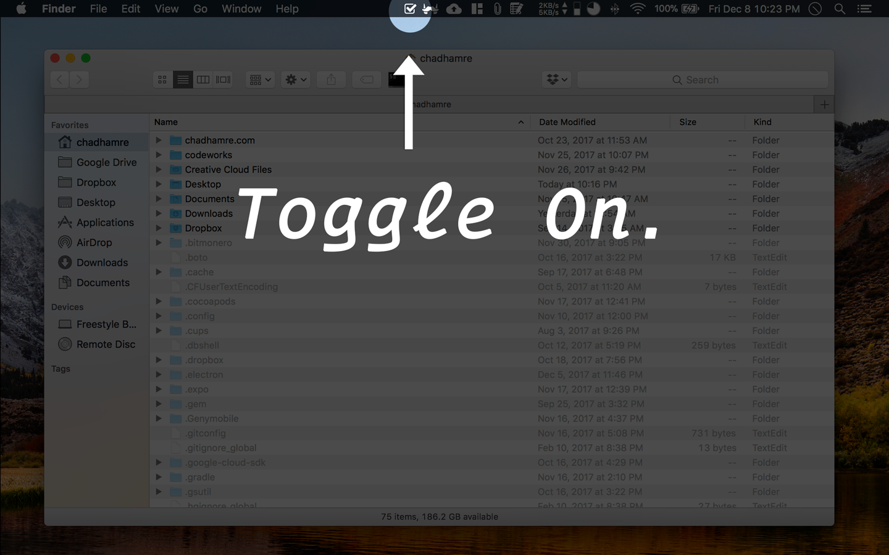

# hidden-files-menu-bar
### Introduction
This repository contains a simple Electron application that will toggle the 'show hidden files in finder' setting on a mac with a button click from the menu bar.
### Getting Started
To run the electron app so that you can add/change features on your fork:
- navigate to `/app`
- run `yarn install`
- run `yarn start`
This should run the application locally.
### Packaging & Distribution
To package a new version of the application:
- run `electron-packager . "Hidden Files Menu Bar" --app-bundle-id=com.electron.hidden-files-menu-bar --helper-bundle-id=com.electron.hidden-files-menu-bar.helper --app-version=1.0.0 --build-version=1.0.101 --platform=mas --arch=x64 --version=0.35.6 --icon=./build/icon.icns --overwrite`
### Screenshots

 

